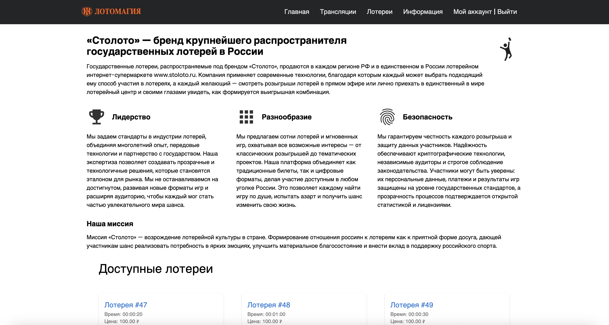
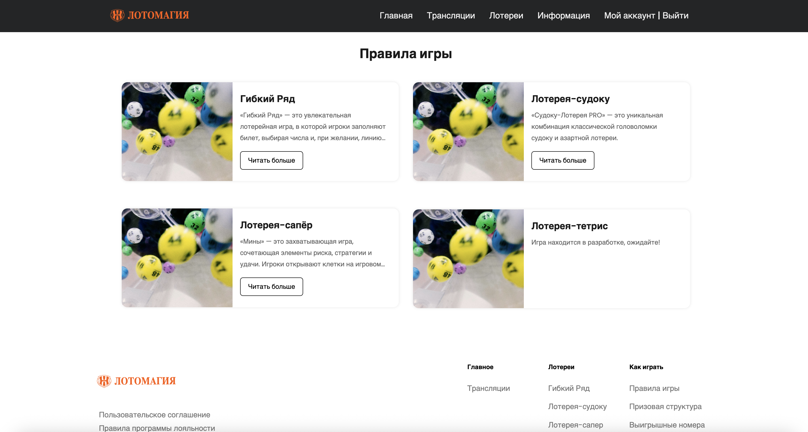

# Лотомагия
Веб-сайт проекта: https://hackathon-2025-final.vercel.app/
Бекенд-сервер проекта: https://hyper-ist.mooo.com/

По умолчанию у новых пользователей нет денег на балансе, ни виртуальном, ни реальном, а потому они могут участвовать в билетах. Есть следующие аккаунты для тестироования на продуктивных сайтах выше:

1. Администратор. Логин - admin, пароль - 111111.
2. Пользователь с балансов в 10 миллионов рублей. Логин - 000, пароль - 111111.

## Запуск проекта
### Запуск веб-сайта
1. Зайти в папку `frontend/`.
2. Запустить следующие команды:
```
npm i
npm run dev
```
Сайт будет запущен на `localhost:3000/`. По умолчанию он будет смотреть на адрес сервера `https://hyper-ist.mooo.com`, его можно поменять в `src/api/index.ts`.




Чтобы запустить веб-сайт в продуктивном режиме:
1. `npm run build`
2. `npm start`
Запустит веб-сайт в продуктивном режиме.

### Запуск бекенд-части проекта
1. Зайти в папку `backend/`.
2. Создать файлы `.env` и `main/.env` с одинаковым содержанием формата:
```
DB_NAME=
DB_USER=
DB_PASSWORD=
DB_HOST=
DB_PORT=
```
Необходимо вставить сюда актуальные переменные окружения для доступа к базе данных. Бека базы данных прилагается в файла `backup.sql` в корне данного репозитория, базу данных можно восстановить из бекапа.
3. Выполнить следующие команды:
```
npm i
npm start
```
HTTP-сервер будет запущен на http://localhost:3000.

Чтобы запустить сервер в продуктивном режиме, есть файл `docker-compose.yml`, который можно запустить через `docker compose up`.

### Запуск телеграм-бота
1. Зайти в папку `telegram-bot/`.
2. Выполнить следующие команды:
```
npm i
node project/bot.js
```
Запустит телеграм-бота в продуктивном режиме.

## Экономическое обоснование и математический анализ
### Экономическое обоснование лотереи «Судоку»

#### Введение
В данном документе представлено обоснование прибыли лотереи «Судоку» с произвольным размером доски и количеством начальных заполненных клеток. Мы проанализируем условие прибыли лотереи и выведем соответствующие формулы.

#### Общие параметры

- **Размер доски**: \( n^2 \times n^2 \) (где \( n \) — порядок судоку, например, \( n=3 \) для стандартной доски 9x9).
- **Общее количество клеток**: \( n^4 \).
- **Начальные заполненные клетки**: \( F \).
- **Количество клеток, которые нужно заполнить**: \( n^4 - F \).
- **Стоимость хода**: \( C_m \) (базовая стоимость).
- **Всего ходов**: \( n^4 - F \).
- **Общая сумма ставок**: \( (n^4 - F) \cdot C_m \).
- **Выплаты**:
  - За завершение строки или столбца: \( P_{rc} \).
  - За завершение блока \( n \times n \): \( P_b \).

#### Условие прибыли

Прибыль определяется как:

\[ 
\text{profit} = \text{total bets} - \text{total payouts} > 0 
\]

#### Выплаты за блоки

- Всего блоков: \( n^2 \).
- Каждый блок содержит \( n^2 \) клеток.
- Выплаты за \( k \) блоков: \( k \cdot P_b \).
- Общая формула прибыли:

\[ 
\text{profit} = (n^4 - F) \cdot C_m - k \cdot P_b 
\]

#### Проверка на стандартной доске

Для стандартной доски (\( n=3, F=15, C_m=5, P_{rc}=15 \)):

- \( n^4 = 81 \)
- \( n^4 - F = 66 \)

Условие прибыли:

\[ 
P_b < \frac{9 \cdot (n^4 - F) \cdot C_m}{4 \cdot n^2} 
\]

#### Окончательная формула

\[ 
P_b < \frac{9 \cdot (n^4 - F) \cdot C_m}{4 \cdot n^2} 
\]

---

### Экономическое обоснование лотереи «Выбери свой ряд»

#### Общее описание

Лотерея "Выбери свой ряд" сочетает элементы классической лотереи и игры в бинго, добавляя стратегическую гибкость.

#### Компоненты игры

- **Карточки игроков**: Сетка 5x5 с уникальными числами.
- **Вытягиваемые числа**: Ведущий вытягивает числа из диапазона (1–75).
- **Ключевое число \( N \)**: Количество чисел, необходимое для победы.

#### Правила игры

1. **Подготовка**: Игроки получают карточки.
2. **Ход игры**: Вытягивание чисел и динамический выбор ряда.
3. **Победа**: Игрок объявляет о заполнении выбранного ряда.
4. **Завершение игры**: Игра продолжается до определения победителя.

#### Стратегический элемент

- **Гибкость выбора**: Игроки могут адаптировать свой выбор в зависимости от хода игры.
- **Риск и вознаграждение**: Баланс между ожиданием и решительностью.

#### Пример игры

- **Карточка игрока**: Пример карточки с числами.
- **Ход игры**: Пример вытягивания чисел и выбора ряда.

#### Заключение

Лотерея "Выбери свой ряд" предлагает увлекательный игровой процесс, где удача сочетается со стратегией.

## Скринкаст
Скринкаст решения прилагается ниже:


## Презентация
Презентация расположена в корне репозитория под названием `"Хакатон РФ.pptx"`.
